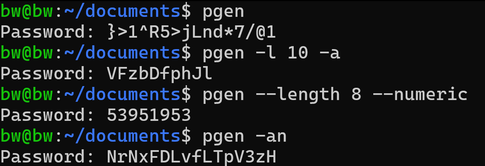

# pgen

A secure and flexible password generator written in Rust.  
Generates random passwords using a cryptographically secure pseudo-random number generator (CSPRNG) with customizable options for length, character set, repetition rules, output handling, and entropy estimation.

---

## Features

- Generates passwords of specified length from a user-defined character set.
- Option to disallow repeated characters in the generated password.
- Uses a custom cryptographically secure RNG seeded from system entropy.
- Supports outputting passwords directly to the console, copying to clipboard, or saving to a file.
- Estimates and displays password entropy based on length and character set size.
- CLI-driven interface with multiple customizable options.

---

## Project Structure

src/

├── cli.rs # CLI Parsing and Struct

├── generator.rs # Password Generation Logic

├── lib.rs

├── main.rs # Program entry point, coordinates flow

├── random.rs # Cryptographically secure RNG

└── utils.rs # Clipboard, File saving, Entropy calc

---

## Usage

Build the project using Cargo:

```bash
cargo build --release
```

Run the binary with your desired options (example):

```bash
./target/release/pgen --length 16 --count 5 --no-repeat --clipboard --entropy
```

### Options
```bash
   --length, -l <number>: Length of each generated password.

   --alphanumeric, -an: Alphanumeric password

   --alpha, -a: Alphabetical password

   --numeric, -n: Numeric password (random number in given length)

   --no-repeat, -nr: Non-repeating characters (appears only once in password)

   --exclude, -ex <String>: Exclude given characters

   --count, -c <number>: Number of passwords to generate.

   --no-repeat, -nr: Disallow repeated characters within each password.

   --clipboard, -cp: Copy generated password to system clipboard.

   --entropy, -en: Display estimated entropy of the generated password.

   --save-path, -s: <file> Save generated passwords to a file.
```
## How It Works

Passwords are generated by selecting random characters from a given charset. The randomness is created from scratch in rust using entropy from the operating systems syscall (ex. getrandom syscall on Linux)


Utilities handle copying passwords to the clipboard and saving them to files.

Entropy is calculated as length * log2(charset_size) and displayed if requested.

## Example Output



License

This project is licensed under the MIT License.
Contribution

Contributions and suggestions are welcome! Feel free to open issues or submit pull requests.

Contact
For questions or feedback, please contact Ben Weinstein (brweinstein68@gmail.com).